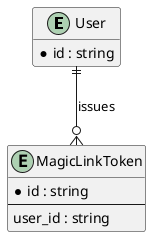

ERD (Crow's Foot)
=================

Entity-Relationship Diagrams use Crow's Foot notation, not UML. They illustrate
relationships between pairs of entities rather than the complete schema.

For the attribute-level schema (the DDT), see `../../Entities.md` and each
module's `../../../modules/<Module>/Entities.md`.

Example (Identity): a `User` has many `MagicLinkToken` rows.

