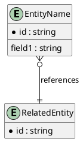

Project Entities Registry (DDT)
===============================

Full List
---------

One row per entity. The attribute-level DDT and PlantUML for each entity live in
`../modules/<Module>/Entities.md`. IDs follow `ENT-<DomainCode>-NNN`.

| Entity ID | Entity Name | Module | Module Role (Core/Column/Complementary) | Source FR/UC | Detail | Owner | Status |
|-----------|-------------|--------|------------------------------------------|--------------|--------|-------|--------|
| ENT-ID-001 | User | Identity | Core | FR-ID-001, UC-ID-Login | ../modules/Module1/Entities.md | PM | Draft |
| ENT-ID-002 | MagicLinkToken | Identity | Complementary | FR-ID-001 | ../modules/Module1/Entities.md | PM | Draft |

---

Module Mapping Template
-----------------------

| Entity ID | Module | Role in Module | Notes |
|-----------|--------|-----------------|-------|
| ENT-XXX   | Module1 | Core / Column / Complementary | |

---

DDT Attribute Template
----------------------

| Entity Name | Attribute/Column Name | Key (PK/FK/-) | Data Type | Not Null (Y/N) | Length | FK Table | Description |
|-------------|------------------------|---------------|-----------|----------------|--------|----------|-------------|
| EntityName  | id                     | PK            | UUID      | Y              | 36     | -        | Primary identifier |
| EntityName  | related_id             | FK            | UUID      | Y              | 36     | RelatedEntity | Foreign key to related entity |

---

Aggregate PlantUML (Optional)
-----------------------------

