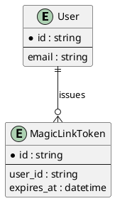

Module1 Entities (DDT)
======================

Entity Classification
---------------------

| Entity ID | Entity Name | Module Role (Core/Column/Complementary) | Source FR/UC | Owner | Status |
|-----------|-------------|------------------------------------------|--------------|-------|--------|
| ENT-ID-001 | User | Core | FR-ID-001, UC-ID-Login | PM | Draft |
| ENT-ID-002 | MagicLinkToken | Complementary | FR-ID-001 | PM | Draft |

DDT (Attribute/Column Level)
----------------------------

| Entity Name | Attribute/Column Name | Key (PK/FK/-) | Data Type | Not Null (Y/N) | Length | FK Table | Description |
|-------------|------------------------|---------------|-----------|----------------|--------|----------|-------------|
| User | id | PK | UUID | Y | 36 | - | Primary identifier |
| User | email | - | VARCHAR | Y | 254 | - | Verified email used for sign-in |
| MagicLinkToken | id | PK | UUID | Y | 36 | - | Primary identifier |
| MagicLinkToken | user_id | FK | UUID | Y | 36 | User | Owning user |
| MagicLinkToken | expires_at | - | DATETIME | Y | - | - | Single-use expiry (<= 10 min) |

Relationship Notes
------------------
- Core entities drive module behavior and scenarios (User anchors sign-in).
- Column entities represent attribute-focused data structures in this module.
- Complementary entities support enrichment, integration, or reporting (MagicLinkToken).
- DDT rows define attribute-level metadata (key type, datatype, nullability, length, FK table, description).

PlantUML
--------

